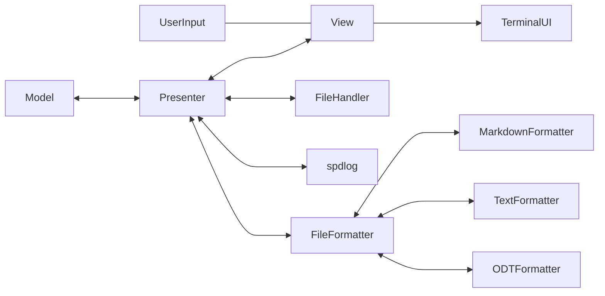

# wordNebula
## Table of Contents
- [Introduction](#introduction)
- [Software Tools](#software-tools)
- [Dependencies](#dependencies)
    - [Libraries](#libraries)
- [Application Architecture](#application-architecture)
    - [Overview Design](#overview-design)
    - [Model](#model)
    - [View](#view)
    - [Presenter](#presenter)
- [Current State](#current-state)
- [Next Steps](#next-steps)

## Introduction
I am a casual reader and the occasional writer of my thoughts. I honestly do not publish anything. This project came about after reading and seeing videos of George R. R. Martin using a word processor that requires DOS to run. After doing some research, I saw these terminal-based word processors still exist. From what I could find out, they still exist due to the fact that professional writers prefer a distraction-free writing environment.

The goal of this project is implement a word processor that focuses having a distraction free environment.

## Software Tools
- VSCode
- CMake
- Devcontainer (for developing in consistent environment across my different computers)

## Dependencies
### Libraries
- ncurses, current terminal UI library might change in the future.
- spdlog

## Application Architecture
I decided to follow the architecture of Model View Presenter. From what I understood starting this project, it fit the scope of being a small to medium project and I like that it was not tightly couple with the **Presenter** being one doing most of the logic. 

While this is a side project and getting the fundamental logic is the first step and saving to a simple text file is the goal. The architecture below shows my over all thoughts on where I would like to eventually get to with this project. 

### Overview Design

### Model
The model will be responsible managing the data, by this I mean it will only take care of keeping the buffer and keeping track of all the edits

### View 
Reponsible for taking user input and rendering all terminal UI and content of the buffer. 

### Presenter
Reponsible for all creating all files, formatting the documents before saving them, creating the logger.

## Current State
Currently it works as the basic you type and it shows up on the terminal nothing beyond that.

## Next Steps
- Model: PieceTable or GapBuffer implementation to track all changes
- Model: Save to file actually
- Presenter: Well this is for me to define all the features I really want to include 
- View: Currently basic will eventually need to scope this part to make it appealing