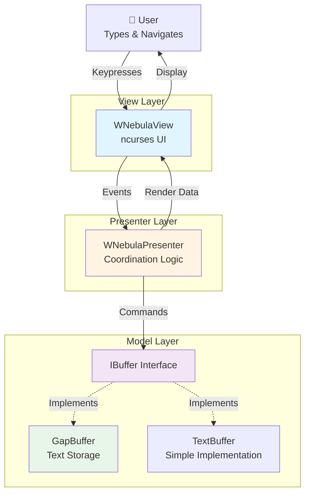
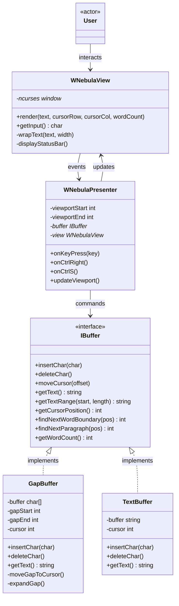
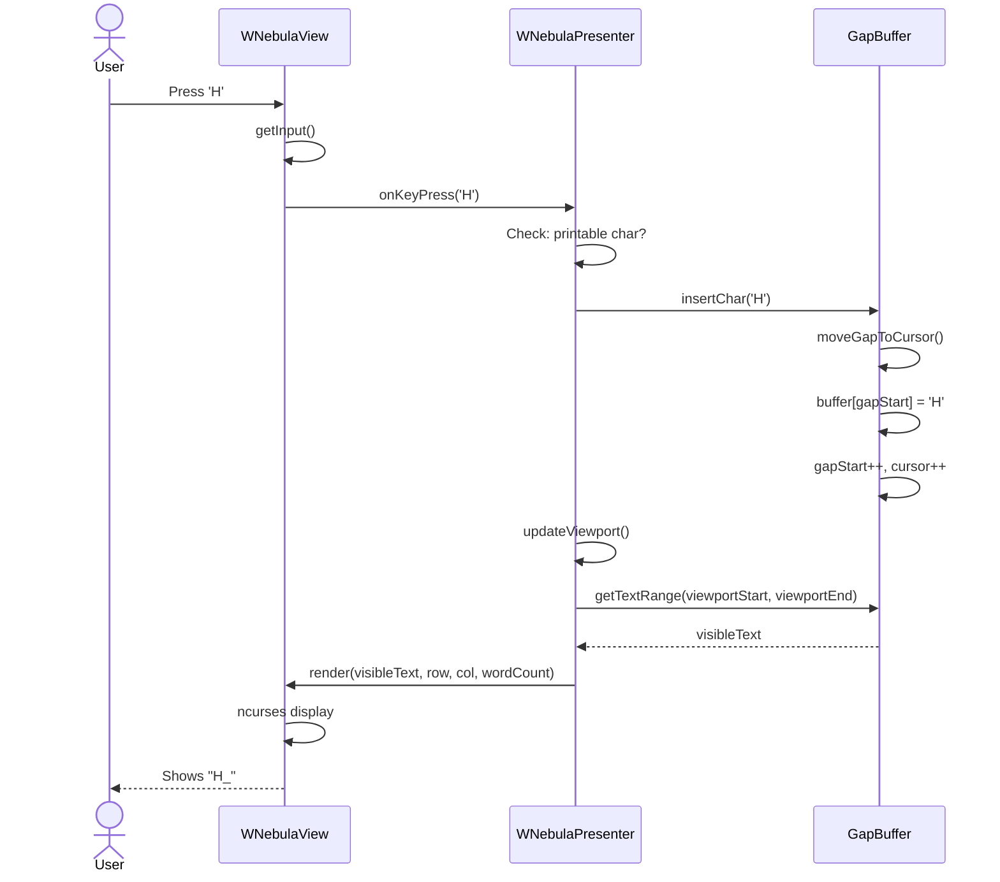
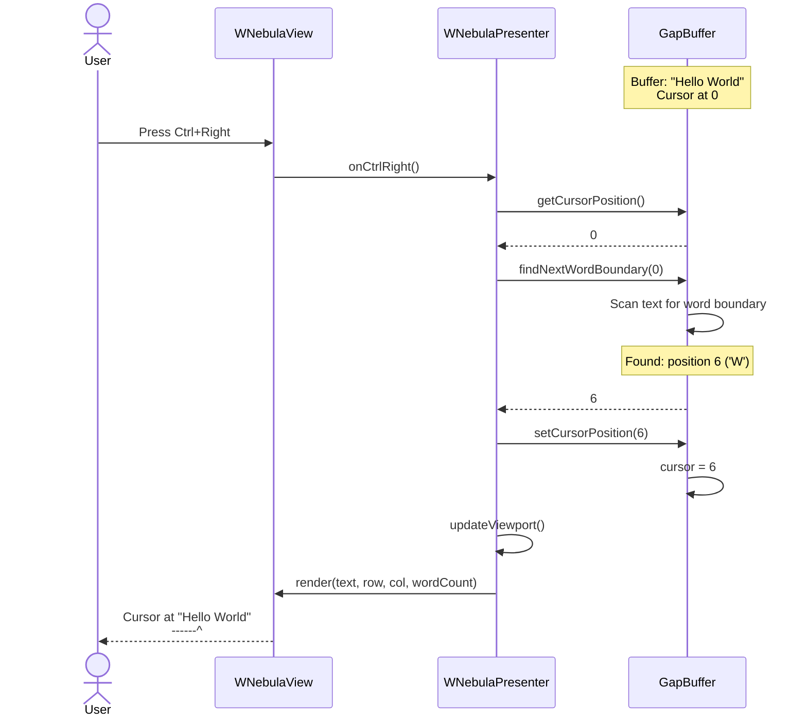
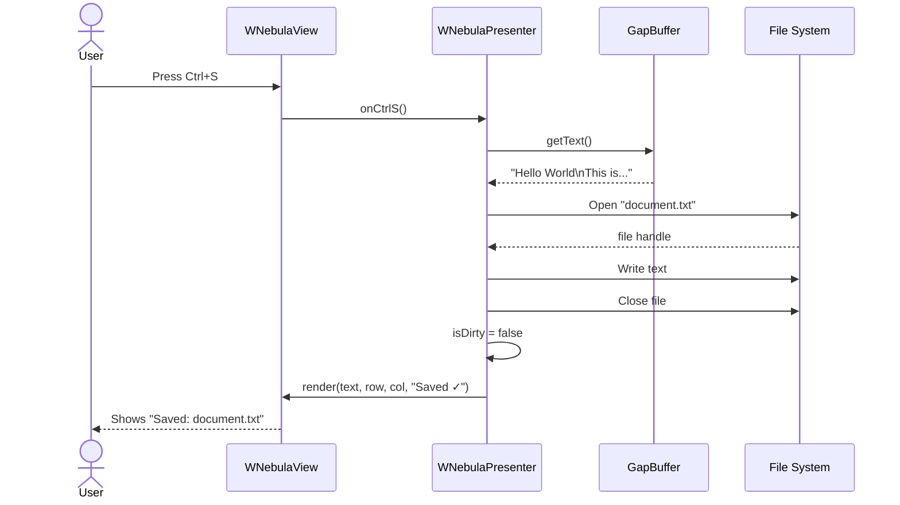
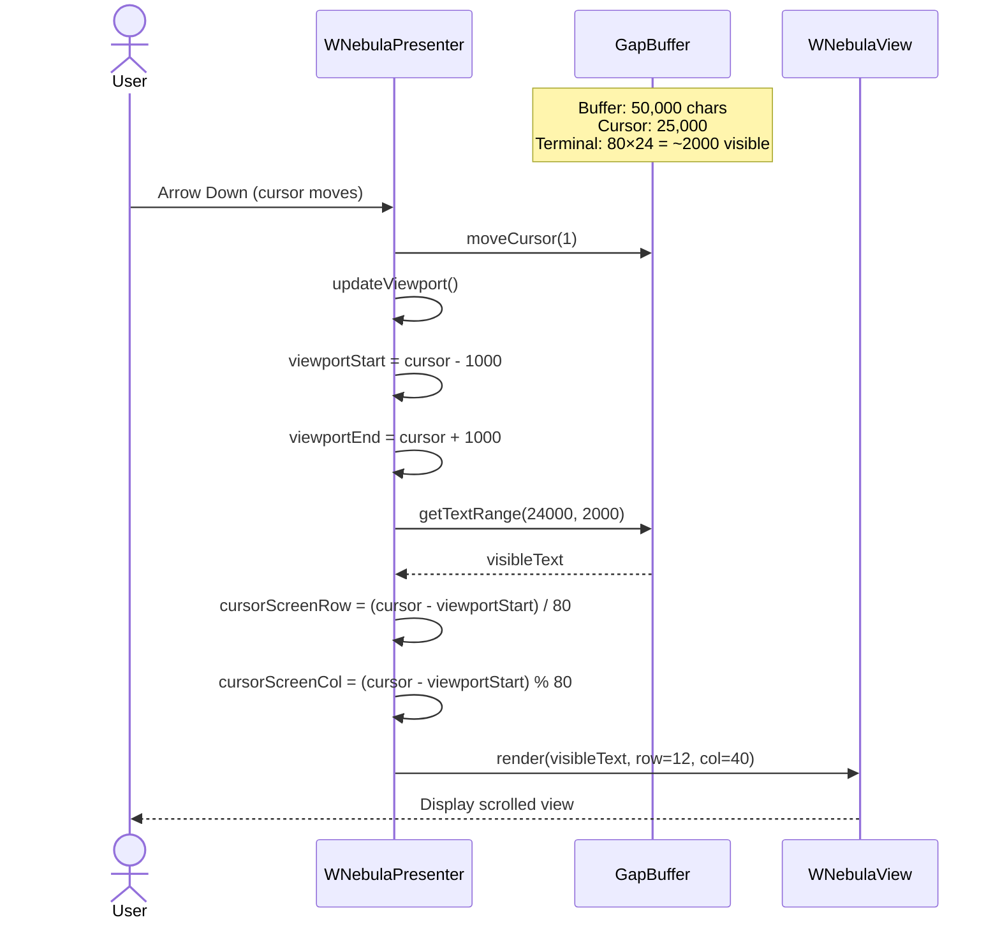
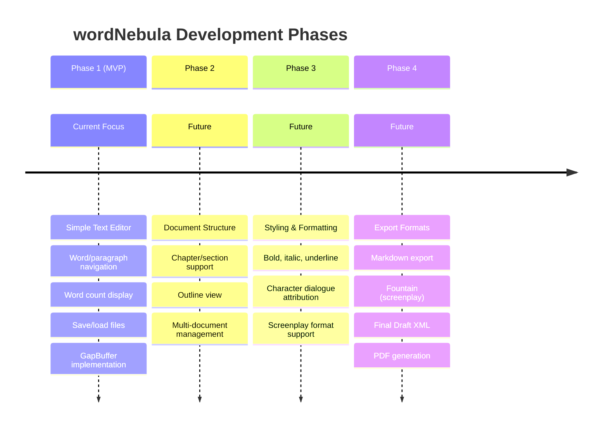

# wordNebula

> A distraction-free terminal-based word processor for writers

[](https://github.com/ileanmjr88/wordNebula/actions/workflows/ci.yml)
[](LICENSE)

______________________________________________________________________

## Table of Contents

- [Introduction](#introduction)
- [Architecture](#architecture)
  - [MVP Pattern](#mvp-pattern-overview)
  - [Component Diagram](#component-diagram)
  - [Sequence Diagrams](#sequence-diagrams)
- [Development Roadmap](#development-roadmap)
- [Phase 1: MVP Features](#phase-1-mvp-features)
- [Build & Run](#build--run)
- [Documentation](#documentation)
- [Dependencies](#dependencies)

______________________________________________________________________

## Introduction

**The Problem**: Modern word processors are full of distractions—toolbars,
notifications, endless formatting options. Professional writers (like George
R.R. Martin with WordStar) prefer simple, focused tools.

**The Solution**: wordNebula is a terminal-based word processor that provides:

- ✅ Distraction-free writing environment
- ✅ Keyboard-centric workflow (hands stay on keyboard)
- ✅ Efficient text editing (GapBuffer for fast typing)
- ✅ Simple file management (save/load plain text)

**Target Users**:

- **Bloggers** - Draft posts without distraction
- **Novelists** - Write long-form prose
- **Screenwriters** - (Future) Screenplay format support
- **Playwrights** - (Future) Theatrical format support

### In-depth discussion of Phase 1
- **[Part 1: The Model](https://www.ilean.me/blog/building-a-terminal-text-editor-the-model-part-1/)** —
  Why MVP over MVC/MVVM, choosing the GapBuffer data structure, and the
  IBuffer interface contract
- **[Part 2: The Presenter](https://www.ilean.me/blog/building-a-terminal-text-editor-the-presenter-part-2/)** —
  Smart pointer ownership (`shared_ptr` / `weak_ptr` to break circular
  dependencies), the InputEvent abstraction, and the ViewState contract
- **[Part 3: The View](https://www.ilean.me/blog/building-a-terminal-text-editor-the-view-part-3/)** —
  Why FTXUI over ncurses, the IView interface for platform portability,
  and cursor rendering

______________________________________________________________________

## Architecture

### MVP Pattern Overview

wordNebula follows the **Model-View-Presenter** (MVP) architectural pattern for
clean separation of concerns and testability.


```mermaid
graph TB
    User[👤 User<br/>Types & Navigates]

    subgraph View Layer
        View[WNebulaView<br/>ncurses UI]
    end

    subgraph Presenter Layer
        Presenter[WNebulaPresenter<br/>Coordination Logic]
    end

    subgraph Model Layer
        IBuffer[IBuffer Interface]
        GapBuffer[GapBuffer<br/>Text Storage]
        TextBuffer[TextBuffer<br/>Simple Implementation]
    end

    User -->|Keypresses| View
    View -->|Events| Presenter
    Presenter -->|Commands| IBuffer
    IBuffer -.->|Implements| GapBuffer
    IBuffer -.->|Implements| TextBuffer
    Presenter -->|Render Data| View
    View -->|Display| User

    style View fill:#e1f5ff
    style Presenter fill:#fff4e1
    style GapBuffer fill:#e8f5e9
    style IBuffer fill:#f3e5f5
```

### Component Diagram


```mermaid
classDiagram
    class User {
        <<actor>>
    }

    class WNebulaView {
        +render(text, cursorRow, cursorCol, wordCount)
        +getInput() char
        -ncurses window*
        -wrapText(text, width)
        -displayStatusBar()
    }

    class WNebulaPresenter {
        +onKeyPress(key)
        +onCtrlRight()
        +onCtrlS()
        +updateViewport()
        -viewportStart int
        -viewportEnd int
        -buffer IBuffer*
        -view WNebulaView*
    }

    class IBuffer {
        <<interface>>
        +insertChar(char)
        +deleteChar()
        +moveCursor(offset)
        +getText() string
        +getTextRange(start, length) string
        +getCursorPosition() int
        +findNextWordBoundary(pos) int
        +findNextParagraph(pos) int
        +getWordCount() int
    }

    class GapBuffer {
        -buffer char[]
        -gapStart int
        -gapEnd int
        -cursor int
        +insertChar(char)
        +deleteChar()
        +getText() string
        -moveGapToCursor()
        -expandGap()
    }

    class TextBuffer {
        -buffer string
        -cursor int
        +insertChar(char)
        +deleteChar()
        +getText() string
    }

    User --> WNebulaView : interacts
    WNebulaView --> WNebulaPresenter : events
    WNebulaPresenter --> IBuffer : commands
    IBuffer <|.. GapBuffer : implements
    IBuffer <|.. TextBuffer : implements
    WNebulaPresenter --> WNebulaView : updates
```

### Sequence Diagrams

#### User Types Character


```mermaid
sequenceDiagram
    actor User
    participant View as WNebulaView
    participant Presenter as WNebulaPresenter
    participant Buffer as GapBuffer

    User->>View: Press 'H'
    View->>View: getInput()
    View->>Presenter: onKeyPress('H')
    Presenter->>Presenter: Check: printable char?
    Presenter->>Buffer: insertChar('H')
    Buffer->>Buffer: moveGapToCursor()
    Buffer->>Buffer: buffer[gapStart] = 'H'
    Buffer->>Buffer: gapStart++, cursor++
    Presenter->>Presenter: updateViewport()
    Presenter->>Buffer: getTextRange(viewportStart, viewportEnd)
    Buffer-->>Presenter: visibleText
    Presenter->>View: render(visibleText, row, col, wordCount)
    View->>View: ncurses display
    View-->>User: Shows "H_"
```

#### User Jumps to Next Word (Ctrl+Right)


```mermaid
sequenceDiagram
    actor User
    participant View as WNebulaView
    participant Presenter as WNebulaPresenter
    participant Buffer as GapBuffer

    Note over Buffer: Buffer: "Hello World"<br/>Cursor at 0

    User->>View: Press Ctrl+Right
    View->>Presenter: onCtrlRight()
    Presenter->>Buffer: getCursorPosition()
    Buffer-->>Presenter: 0
    Presenter->>Buffer: findNextWordBoundary(0)
    Buffer->>Buffer: Scan text for word boundary
    Note over Buffer: Found: position 6 ('W')
    Buffer-->>Presenter: 6
    Presenter->>Buffer: setCursorPosition(6)
    Buffer->>Buffer: cursor = 6
    Presenter->>Presenter: updateViewport()
    Presenter->>View: render(text, row, col, wordCount)
    View-->>User: Cursor at "Hello World"<br/>           ------^
```

#### User Saves File (Ctrl+S)


```mermaid
sequenceDiagram
    actor User
    participant View as WNebulaView
    participant Presenter as WNebulaPresenter
    participant Buffer as GapBuffer
    participant FS as File System

    User->>View: Press Ctrl+S
    View->>Presenter: onCtrlS()
    Presenter->>Buffer: getText()
    Buffer-->>Presenter: "Hello World\nThis is..."
    Presenter->>FS: Open "document.txt"
    FS-->>Presenter: file handle
    Presenter->>FS: Write text
    Presenter->>FS: Close file
    Presenter->>Presenter: isDirty = false
    Presenter->>View: render(text, row, col, "Saved ✓")
    View-->>User: Shows "Saved: document.txt"
```

#### Viewport Scrolling


```mermaid
sequenceDiagram
    actor User
    participant Presenter as WNebulaPresenter
    participant Buffer as GapBuffer
    participant View as WNebulaView

    Note over Buffer: Buffer: 50,000 chars<br/>Cursor: 25,000<br/>Terminal: 80×24 = ~2000 visible

    User->>Presenter: Arrow Down (cursor moves)
    Presenter->>Buffer: moveCursor(1)
    Presenter->>Presenter: updateViewport()
    Presenter->>Presenter: viewportStart = cursor - 1000
    Presenter->>Presenter: viewportEnd = cursor + 1000
    Presenter->>Buffer: getTextRange(24000, 2000)
    Buffer-->>Presenter: visibleText
    Presenter->>Presenter: cursorScreenRow = (cursor - viewportStart) / 80
    Presenter->>Presenter: cursorScreenCol = (cursor - viewportStart) % 80
    Presenter->>View: render(visibleText, row=12, col=40)
    View-->>User: Display scrolled view
```

______________________________________________________________________

## Development Roadmap


```mermaid
timeline
    title wordNebula Development Phases

    section Phase 1 (MVP)
        Current Focus : Simple Text Editor
                      : Word/paragraph navigation
                      : Word count display
                      : Save/load files
                      : GapBuffer implementation

    section Phase 2
        Future : Document Structure
               : Chapter/section support
               : Outline view
               : Multi-document management

    section Phase 3
        Future : Styling & Formatting
               : Bold, italic, underline
               : Character dialogue attribution
               : Screenplay format support

    section Phase 4
        Future : Export Formats
               : Markdown export
               : Fountain (screenplay)
               : Final Draft XML
               : PDF generation
```

______________________________________________________________________

## Phase 1: MVP Features

### ✅ Core Editing

- [x] Type continuous text
- [x] Insert character at cursor
- [x] Backspace (onDelete)
- [x] Delete forward (onDeleteForward)
- [x] Cursor movement (arrows)
- [ ] Soft line wrapping (View layer - in progress)

### ✅ Smart Navigation

- [x] Ctrl+Left/Right - Jump by word (findNextWordBoundary,
  findPrevWordBoundary)
- [x] Ctrl+Up/Down - Jump by paragraph (findNextParagraph, findPrevParagraph)
- [x] Home/End - Start/end of document
- [ ] Ctrl+Home/End - Start/end of document (deferred - same as Home/End for
  Phase 1)

### ✅ File Operations

- [x] Track unsaved changes (isDirty flag) with warnings on exit
- [x] File I/O structure in place (saveFile, loadFile stubbed)
- [ ] Full file I/O implementation (deferred to integration phase)

### ✅ Status Display

- [x] Word count calculation (getWordCount in Model)
- [x] Paragraph count calculation (getParagraphCount in Model)
- [x] Cursor position tracking (getCursorPosition)
- [ ] Status bar UI display (View layer - in progress)

### ✅ Buffer Implementation

- [x] Update IBuffer interface (complete API with full documentation)
- [x] Implement GapBuffer with all methods
- [x] Write comprehensive unit tests (test_GapBuffer.cpp)
- [x] Fix existing bugs (cursor management, gap movement)

### 🚧 Current Status (as of 2026-02-15)

**Completed:**

- ✅ **Model Layer**: IBuffer interface and GapBuffer fully implemented and
  tested
- ✅ **Presenter Layer**: All navigation, text operations, and state management
  complete
- ✅ **Test Coverage**: GapBuffer has comprehensive test suite

**In Progress:**

- 🟡 **View Layer**: Being developed in separate branch (phase1/view)
- 🟡 **Integration**: Full file I/O to be implemented during integration phase

**Architecture:**

- Clean MVP pattern with proper separation of concerns
- Interface-based design allowing swappable buffer implementations
- Smart pointer usage (shared_ptr for Model, weak_ptr for View)
- Comprehensive Doxygen documentation throughout

______________________________________________________________________

## Build & Run

wordNebula uses [Compendium](https://compendium.ilean.me) to provision a
reproducible toolchain (clang, cmake, ninja, ccache, vcpkg, Python) declared
in [compendium.toml](compendium.toml). One-time setup pulls everything pinned
to the project's versions — no system package install required.

### 1. Install Compendium (one-time, machine-wide)

```bash
# curl
curl -fsSL https://compendium.ilean.me/install.sh | sh

# or wget
wget -qO- https://compendium.ilean.me/install.sh | sh
```

Add `~/.local/bin` to your `PATH` if the installer prompts you, then restart
your shell.

### 2. Provision the project toolchain

From the repo root, install everything declared in `compendium.toml` (clang
22, cmake, ninja, ccache, vcpkg, and project libraries via vcpkg):

```bash
compendium install
```

### 3. Activate the environment

Source the project's init script before building or opening VS Code. It runs
`compendium activate` and derives `VCPKG_TARGET_TRIPLET` for your platform
(arm64-osx, x64-osx, x64-linux, arm64-linux):

```bash
source scripts/init-env.sh
```

> Re-run this in any new shell where you want to build or debug wordNebula.

### 4. Build, test, and run

```bash
cmake --preset compendium             # configure
cmake --build --preset compendium     # build
ctest  --preset compendium            # test
./build/bin/wordNebula                # run
```

Other presets:

- `compendium-debug` — Debug build with AddressSanitizer + UBSan
- `compendium-release` — optimized release build

### Build Options

```bash
# Enable extra code-quality checks
cmake --preset compendium \
  -DENABLE_COVERAGE=ON \
  -DENABLE_SANITIZERS=ON \
  -DENABLE_CLANG_TIDY=ON
```

### Development Tools

```bash
# Format code (automatic via pre-commit hooks)
cmake --build build --target format

# Code coverage (uses GCC 12; outputs to build-coverage/)
cmake --preset coverage
cmake --build build-coverage --target coverage
# View: build-coverage/coverage/index.html

# Memory checking
valgrind --leak-check=full ./build/bin/wordNebula
```

______________________________________________________________________

## Documentation

### 📚 Architecture & Design

- **[CLAUDE.md](CLAUDE.md)** - Project guidelines, build system, coding
  standards
- **[docs/designs/PHASE1_ARCHITECTURE.md](docs/designs/PHASE1_ARCHITECTURE.md)**
  \- Detailed Phase 1 architecture with diagrams and implementation checklist
- **[docs/designs/DESIGN_MVP_WORD_PROCESSOR.md](docs/designs/DESIGN_MVP_WORD_PROCESSOR.md)**
  \- Design decisions and Q&A
- **[docs/designs/BRANCHING_STRATEGY.md](docs/designs/BRANCHING_STRATEGY.md)** -
  Git workflow and branch protection

### 🔧 Development Setup

- **[POST_REBUILD_GUIDE.md](POST_REBUILD_GUIDE.md)** - DevContainer setup
  instructions
- **[.devcontainer/README.md](.devcontainer/README.md)** - Container
  configuration details

### 📝 Session Notes

- **[SESSION_2026-02-14.md](SESSION_2026-02-14.md)** - Design session summary

______________________________________________________________________

## Dependencies

### Core Libraries

- **FTXUI** - Modern C++ terminal UI library (functional/component-based)
- **spdlog** - Structured logging

### Development Tools

- **CMake 3.16+** - Build system
- **Ninja** - Build tool (recommended)
- **Clang 16** - Default compiler (GCC 12 also supported)
- **Google Test** - Unit testing framework
- **clang-format** - Code formatting (LLVM style)
- **clang-tidy** - Static analysis
- **cppcheck** - Additional static checks
- **Doxygen** - API documentation generation
- **lcov/gcov** - Code coverage reporting
- **Valgrind** - Memory leak detection

### Installation (DevContainer)

The project includes a DevContainer with all dependencies pre-installed. Open in
VS Code with the Remote-Containers extension:

```bash
# 1. Open VS Code
# 2. Command Palette: "Dev Containers: Reopen in Container"
# 3. Wait for container to build
# 4. Run verification: ./.devcontainer/verify-setup.sh
```

### Manual Installation (Ubuntu/Debian)

System tools only — project dependencies (ftxui, spdlog, gtest) are managed by
vcpkg:

```bash
sudo apt-get update && sudo apt-get install -y \
    build-essential \
    cmake \
    ninja-build \
    clang-16 \
    ccache \
    clang-tidy \
    cppcheck \
    lcov \
    gcovr \
    valgrind \
    doxygen
```

______________________________________________________________________

## Development Environment

### Compiler Configuration

wordNebula defaults to **Clang 16** for compilation:

- Better diagnostics and error messages
- Faster incremental builds
- Superior sanitizer support (AddressSanitizer, UBSan)
- Native clang-tidy integration

GCC 12 is also supported as an alternative.

### CI/CD

GitHub Actions runs on every push to `main` and `develop`:

- ✅ Build and test (Debug mode)
- ✅ Code coverage reporting (Codecov)
- ✅ Static analysis (clang-tidy, cppcheck)
- ✅ Code formatting checks
- ✅ Sanitizer builds (AddressSanitizer, UBSan)

See [.github/workflows/ci.yml](.github/workflows/ci.yml) for details.

### Branch Protection

The `main` branch is protected and requires:

- ✅ Pull request before merging
- ✅ All CI checks must pass
- ✅ No direct pushes allowed

See [docs/BRANCHING_STRATEGY.md](docs/BRANCHING_STRATEGY.md) for git workflow.

______________________________________________________________________

## Project Structure

```
wordNebula/
├── src/                        # Source files
│   ├── Model/                  # Buffer implementations
│   │   ├── TextBuffer.cpp      # Simple string-based buffer
│   │   └── GapBuffer.cpp       # Gap buffer (in development)
│   ├── View/                   # FTXUI-based UI
│   │   └── FtxuiView.cpp
│   ├── Presenter/              # Business logic
│   │   └── WNebulaPresenter.cpp
│   └── WordNebula.cpp          # Main entry point
├── include/                    # Header files
│   ├── Model/
│   │   ├── IBuffer.hpp         # Buffer interface
│   │   ├── TextBuffer.hpp
│   │   └── GapBuffer.hpp
│   ├── View/
│   │   ├── IView.hpp           # View interface
│   │   ├── FtxuiView.hpp
│   │   └── KeyboardShortcuts.hpp
│   └── Presenter/
│       └── WNebulaPresenter.hpp
├── tests/                      # Unit tests
│   ├── test_TextBuffer.cpp
│   └── test_GapBuffer.cpp
├── docs/                       # Documentation
│   ├── PHASE1_ARCHITECTURE.md
│   ├── DESIGN_MVP_WORD_PROCESSOR.md
│   └── BRANCHING_STRATEGY.md
├── .devcontainer/              # Development container
│   ├── Dockerfile
│   └── devcontainer.json
├── .github/workflows/          # CI/CD pipelines
│   └── ci.yml
├── CMakeLists.txt              # Build configuration
├── CLAUDE.md                   # Project guidelines
└── README.md                   # This file
```

______________________________________________________________________

## Contributing

This is currently a solo project for learning and portfolio purposes. However,
suggestions and feedback are welcome!

If you'd like to contribute:

1. Fork the repository
1. Create a feature branch (`git checkout -b feature/amazing-feature`)
1. Follow the coding guidelines in [CLAUDE.md](CLAUDE.md)
1. Ensure all tests pass (formatting handled automatically by pre-commit hooks)
1. Submit a pull request

______________________________________________________________________

## License

This project is licensed under the MIT License - see the [LICENSE](LICENSE) file
for details.

______________________________________________________________________

## Acknowledgments

Inspired by:

- **WordStar** - George R.R. Martin's tool of choice
- **WriteRoom** - Distraction-free writing for Mac
- **iA Writer** - Clean, focused writing interface

Built with guidance from modern software engineering practices:

- Clean architecture (MVP pattern)
- Test-driven development (Google Test)
- Continuous integration (GitHub Actions)
- Static analysis (clang-tidy, cppcheck)
- Code coverage tracking

______________________________________________________________________

## Contact

**Ilean Monterrubio Jr**

Portfolio: [link](https://ilean.me) | GitHub:
[@ileanmjr88](https://github.com/ileanmjr88) | LinkedIn:
[ilean-monterrubio-jr](https://linkedin.com/in/ilean-monterrubio-jr)

______________________________________________________________________

**wordNebula** - Where words flow freely, distractions fade away.
